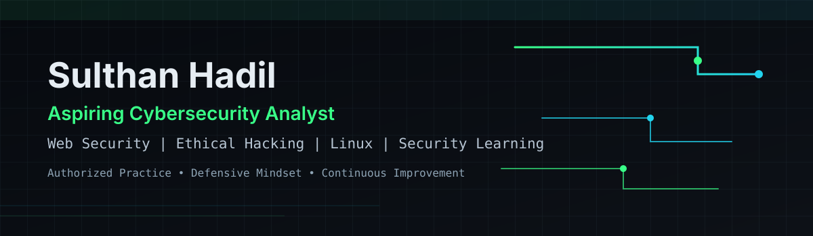

# Sulthan Hadil — Cybersecurity Portfolio

I’m **Sulthan Hadil** (`sulthanhadilk`), a **BCA student at the University of Calicut (June 2023 – March 2026)**, preparing for an entry-level cybersecurity role.

I’m building toward a career as an **Aspiring Cybersecurity Analyst** with focus on web application security, ethical hacking fundamentals, Linux environments, and responsible security learning.

- LinkedIn: [sulthan-hadil-387590313](https://www.linkedin.com/in/sulthan-hadil-387590313/)
- GitHub: [github.com/sulthanhadilk](https://github.com/sulthanhadilk)

## Current focus

- Web application security fundamentals and secure development habits
- Linux/Kali Linux workflows for security learning labs
- Network security and vulnerability assessment fundamentals
- Authorized, ethical security testing and remediation practice

## Technical skills

### Cybersecurity and security learning
- Cybersecurity fundamentals
- Ethical hacking concepts
- Web application security basics
- Vulnerability assessment concepts
- Network security fundamentals
- Authorized security testing practices

### Operating systems
- Linux
- Kali Linux

### Development
- JavaScript
- React
- Vite
- Tailwind CSS
- Node.js
- Express
- WebSockets
- LiveKit integration components

### Tools and workflow
- Git
- GitHub
- Command-line workflows
- Postman

## Featured projects

### 1) Stranger Chat Web Application
- Frontend: [sulthanhadilk/stranger-chat-web](https://github.com/sulthanhadilk/stranger-chat-web)
- Backend companion: [sulthanhadilk/stranger-backend](https://github.com/sulthanhadilk/stranger-backend)

A real-time communication project focused on random 1:1 chat architecture and signaling patterns.

Verified stack in the repositories includes **React 18, Vite, React Router, LiveKit client/components** (frontend) and **Node.js/Express, WebSocket (`ws`), Redis (`ioredis`), LiveKit server SDK, Helmet, rate limiting, Joi, CORS, dotenv, geoip-lite** (backend/server).

The repositories demonstrate implemented real-time and backend scaffolding patterns; some capabilities are documented as setup/scaffolding and should not be treated as production guarantees.

### 2) Attendance Management System
- Frontend: [sulthanhadilk/attendence-front](https://github.com/sulthanhadilk/attendence-front)
- Backend: [sulthanhadilk/attendance-back](https://github.com/sulthanhadilk/attendance-back)

A full-stack attendance management project with a React frontend and Express/MongoDB backend structure.

Verified technologies include **React 18, Vite, Bootstrap, React Router, Axios, Chart.js, TensorFlow.js, OpenAI client, Framer Motion, jsPDF/CSV tooling** (frontend) and **Node.js, Express, MongoDB/Mongoose, JWT, bcryptjs, dotenv, CORS, express-validator, Helmet, compression, morgan, multer, PDF/CSV reporting** (backend).

Documented backend functionality includes role-oriented admin/teacher/student routes, attendance workflows, exams/results, reports, and authentication.

## Cybersecurity learning roadmap

- OWASP-aligned web security foundations ([OWASP](https://owasp.org/))
- HTTP, cookies, sessions, and authentication models
- Access control and common web vulnerability patterns
- Linux command-line and system fundamentals
- Core network protocols and security concepts
- Secure coding and remediation workflows
- Legal, authorized hands-on practice labs

## GitHub activity

The widgets below are third-party visual summaries and may occasionally be unavailable.

  
  

## Professional principles

- Authorized testing only
- Responsible disclosure
- Privacy and data protection awareness
- Clear technical documentation
- Reproducible technical workflows
- Continuous learning and iterative improvement

## Contact

- LinkedIn: [https://www.linkedin.com/in/sulthan-hadil-387590313/](https://www.linkedin.com/in/sulthan-hadil-387590313/)
- GitHub: [https://github.com/sulthanhadilk](https://github.com/sulthanhadilk)

Thanks for visiting my profile.
